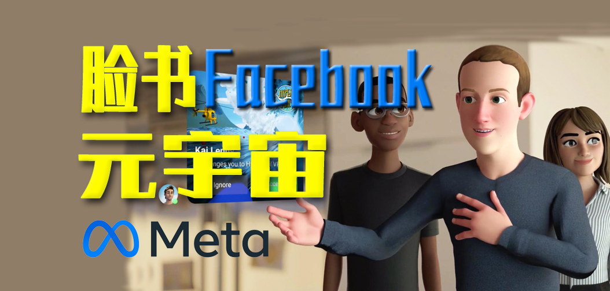
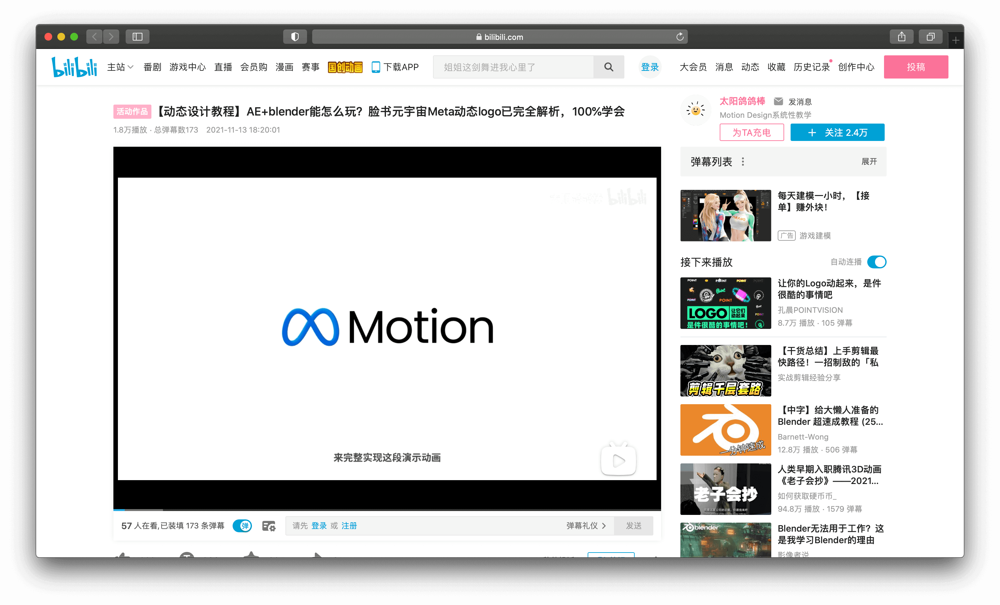

# 3D META LOGO 🌌




## 背景


### 什么是元宇宙

「元宇宙」的内涵是吸纳了信息革命（5G/6G)、互联网革命（web3.0）、人工智能革命，以及 VR、AR、MR，特别是游戏引擎在内的虚拟现实技术革命的成果，向人类展现出构建与传统物理世界平行的全息数字世界的可能性；引发了信息科学、量子科学，数学和生命科学的互动，改变科学范式；推动了传统的哲学、社会学甚至人文科学体系的突破；囊括了所有的数字技术，包括区块链技术成就；丰富了数字经济转型模式，融合 DeFi、IPFS、NFT 等数字金融成果。


———数字资产研究院学术与技术委员会主任朱嘉明教授


源起

「Metaverse」一词由前缀「meta」（意为「超越」「元」）和词根「verse」（源于 universe「宇宙」）组成，直译而来便是「元宇宙」。这一概念最早出自于尼尔·斯蒂芬森 1992 年出版的科幻小说《雪崩》(Snow Crash)，指在一个脱离于物理世界，却始终在线的平行数字世界中，人们能够在其中以虚拟人物角色 (avatar) 自由生活。


什么是元宇宙


元宇宙这个词源于 1992 年尼尔·斯蒂芬森的《雪崩》，这本书描述了一个平行于现实世界的虚拟世界，Metaverse，所有现实生活中的人都有一个网络分身 Avatar。维基百科对元宇宙的描述是：通过虚拟增强的物理现实，呈现收敛性和物理持久性特征的，基于未来互联网，具有链接感知和共享特征的 3D 虚拟空间。


正如电影《头号玩家》的场景，在未来的某一天，人们可以随时随地切换身份，自由穿梭于物理世界和数字世界，在虚拟空间和时间节点所构成的「元宇宙」中学习、工作、交友、购物、旅游等。元宇宙，这个建立在区块链之上的虚拟世界，去中心化平台让玩家享有所有权和自治权。通过沉浸式的体验，让虚拟进一步接近现实。


## 效果


> 在线预览

## 实现

### 版本1

### 版本2

#### 建模



> https://www.bilibili.com/video/BV1Bf4y1T7ce

#### 代码实现


#### 加载模型

#### 动画

#### loading

#### 点击更换材质

#### 点击添加高亮边框


## 总结

## meta 0

```js
function init() {

  var stats = initStats();
  var renderer = initRenderer();
  var camera = initCamera();
  var scene = new THREE.Scene();
  initDefaultLighting(scene);
  var groundPlane = addLargeGroundPlane(scene)
  groundPlane.position.y = -30;

  var step = 0;
  var spGroup;

  var controls = new function () {
    this.appliedMaterial = applyMeshNormalMaterial
    this.castShadow = true;
    this.groundPlaneVisible = true;
    this.numberOfPoints = 20;
    this.deafultpoints = [
      [0, 0.4, -0.4],
      [0.4, 0, 0],
      [0.4, 0.8, 0.4],
      [0, 0.4, 0.4],
      [-0.4, 0, 0],
      [-0.4, 0.8, -0.4],
      [0, 0.4, -0.4]
    ]
    this.segments = 64;
    this.radius = 1;
    this.radiusSegments = 8;
    // 是否闭合
    this.closed = true;
    this.points = [];
    // we need the first child, since it's a multimaterial

    this.newPoints = function () {
      var points = [];
      for (var i = 0; i < controls.deafultpoints.length; i++) {
        var _x = controls.deafultpoints[i][0] * 22;
        var _y = controls.deafultpoints[i][1] * 22;
        var _z = controls.deafultpoints[i][2] * 22;
        points.push(new THREE.Vector3(_x, _y, _z));
      }
      controls.points = points;
      controls.redraw();
    };

    this.redraw = function () {
      redrawGeometryAndUpdateUI(gui, scene, controls, function() {
        return generatePoints(controls.points, controls.segments, controls.radius, controls.radiusSegments,
          controls.closed);
      });
    };

  };

  var gui = new dat.GUI();
  gui.add(controls, 'newPoints');
  gui.add(controls, 'numberOfPoints', 2, 200).step(1).onChange(controls.newPoints);
  gui.add(controls, 'segments', 0, 200).step(1).onChange(controls.redraw);
  gui.add(controls, 'radius', 0, 10).onChange(controls.redraw);
  gui.add(controls, 'radiusSegments', 0, 200).step(1).onChange(controls.redraw);
  gui.add(controls, 'closed').onChange(controls.redraw);

  gui.add(controls, 'appliedMaterial', {
    meshNormal: applyMeshNormalMaterial,
    meshStandard: applyMeshStandardMaterial
  }).onChange(controls.redraw)

  gui.add(controls, 'castShadow').onChange(function(e) {controls.mesh.castShadow = e})
  gui.add(controls, 'groundPlaneVisible').onChange(function(e) {groundPlane.material.visible = e})

  controls.newPoints();

  render();

  function generatePoints(points, segments, radius, radiusSegments, closed) {
    if (spGroup) scene.remove(spGroup)
    spGroup = new THREE.Object3D();
    var material = new THREE.MeshBasicMaterial({
      color: 0xff0000,
      transparent: false
    });
    points.forEach(function (point) {

      var spGeom = new THREE.SphereGeometry(0.1);
      var spMesh = new THREE.Mesh(spGeom, material);
      spMesh.position.copy(point);
      spGroup.add(spMesh);
    });
    // add the points as a group to the scene
    scene.add(spGroup);
    return new THREE.TubeGeometry(new THREE.CatmullRomCurve3(points), segments, radius, radiusSegments, closed);
  }

  function render() {
    stats.update();
    controls.mesh.rotation.y = step
    controls.mesh.rotation.x = step += 0.01
    controls.mesh.rotation.z = step

    if (spGroup) {
      spGroup.rotation.y = step
      spGroup.rotation.x = step
      spGroup.rotation.z = step
    }

    requestAnimationFrame(render);
    renderer.render(scene, camera);
  }
}
```

## 参考资料

1. 什么是元宇宙：https://zhuanlan.zhihu.com/p/392257538


免费模型下载 https://www.mixamo.com/
