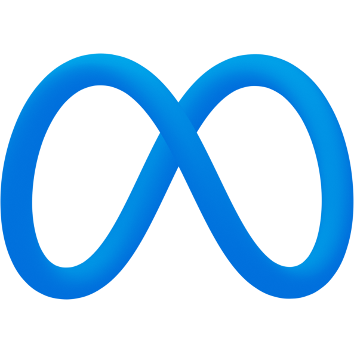
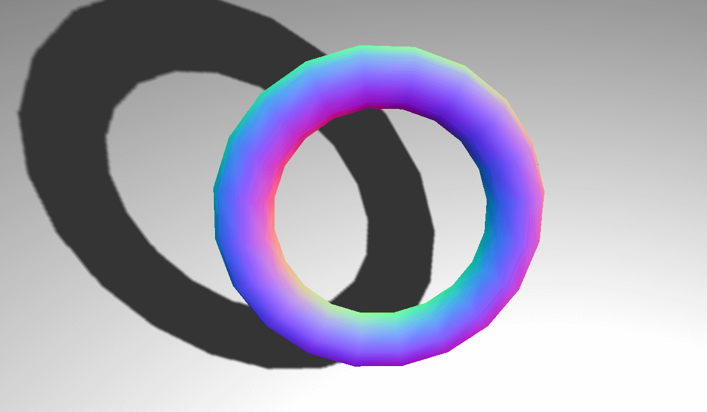
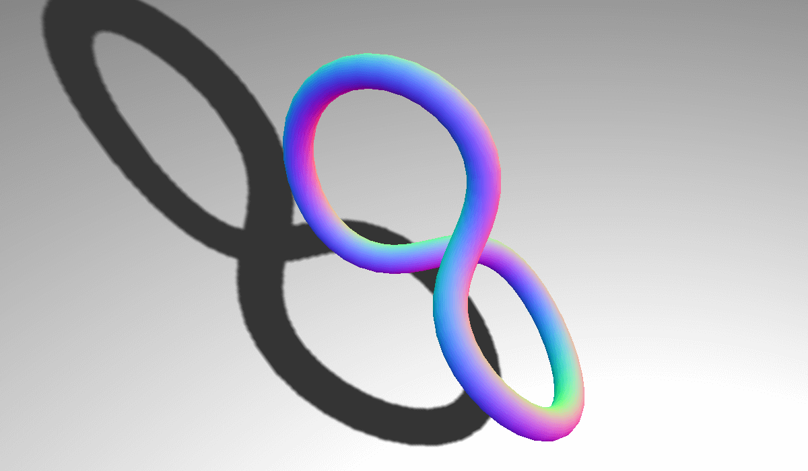
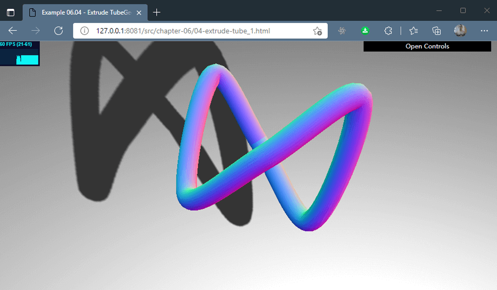
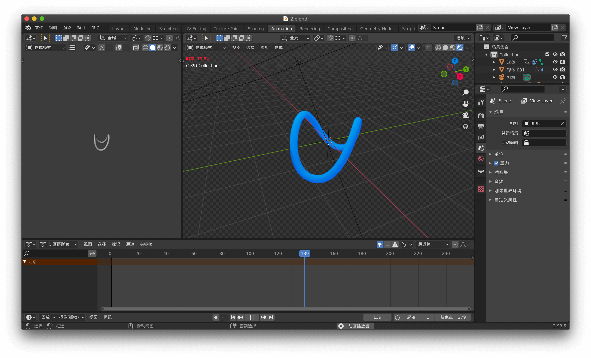
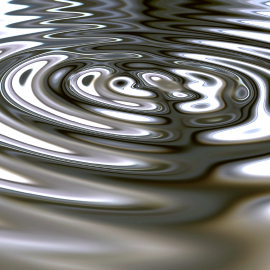
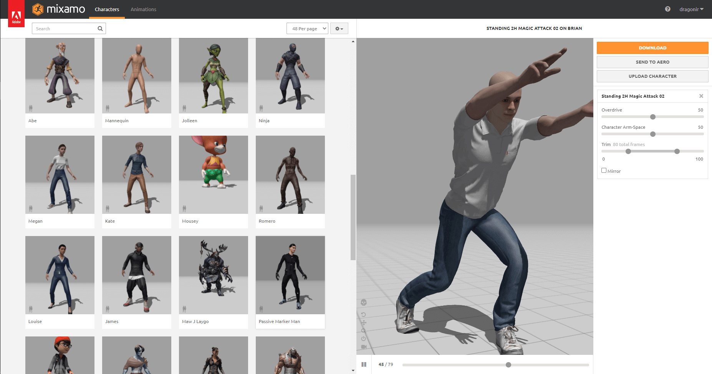

# Three.js实现脸书元宇宙3D动态Logo


## 背景

`Facebook` 近期将其母公司改名为 `Meta`，宣布正式开始进军 `元宇宙 🪐`领域。本文主要讲述通过 `Three.js` + `Blender` 技术栈，实现 `Meta` 公司炫酷的 `3D` 动态 `Logo`，内容包括基础模型圆环、环面扭结、管道及模型生成、模型加载、添加动画、添加点击事件、更换材质等。

### 什么是元宇宙

**元宇宙 Metaverse** 一词源于 `1992` 年尼尔·斯蒂芬森的 `《雪崩》`，该书描述了一个平行于现实世界的虚拟世界 `Metaverse`，所有现实生活中的人都有一个网络分身 `Avatar`。`维基百科` 对元宇宙的描述是：**通过虚拟增强的物理现实，呈现收敛性和物理持久性特征的，基于未来互联网，具有链接感知和共享特征的 `3D` 虚拟空间**。


> **元宇宙**的内涵是吸纳了信息革命 `5G/6G`、互联网革命 `web3.0`、人工智能革命，以及 `VR`、`AR`、`MR`，特别是游戏引擎在内的虚拟现实技术革命的成果，向人类展现出构建与传统物理世界平行的全息数字世界的可能性；引发了信息科学、量子科学，数学和生命科学的互动，改变科学范式；推动了传统的哲学、社会学甚至人文科学体系的突破；囊括了所有的数字技术。正如电影 `《头号玩家》` 的场景，**在未来某一天，人们可以随时随地切换身份，自由穿梭于物理世界和数字世界，在虚拟空间和时间节点所构成的元宇宙中生活学习**。

## 实现效果

进入正题，先来看看本文示例的实现效果。


> `🔗` 在线预览：[https://dragonir.github.io/3d-meta-logo](https://dragonir.github.io/3d-meta-logo/)  （由于模型较大，加载进度可能比较缓慢，需要耐心等待）

## 开发实现

> `📌` 注意：上述示例动图展示的是**试炼四**，不想看试错过程（试炼一、试炼二、试炼三）的，可直接跳转到**试炼四**段落查看详细实现流程。失败流程中都列出了难点，知道解决方案的大佬请在评论区不吝赐教。



开发之前我们先观察一下 `Meta Logo`，可以发现它是一个**圆环经过对折扭曲形成的**，因此实现它的时候可以从实现圆环开始。

### 试炼一：THREE.TorusGeometry

`Three.js` 提供的基础几何体 `THREE.TorusGeometry`（圆环），它是一种看起来像甜甜圈 `🍩` 的简单图形。主要参数：

* `radius`：可选。定义圆环的半径尺寸。默认值是 `1`。
* `tube`：可选。定义圆环的管子半径。默认值是 `0.4`。
* `radialSegments`：可选。定义圆环长度方向上的分段数。默认值是 `8`。
* `tubularSegments`：可选。定义圆环宽度方向上的分段数。默认值是 `6`。
* `arc`：可选。定义圆环绘制的长度。取值范围是 `0` 到 `2 * π`。默认值是 `2 * π`（一个完整的圆）。

语法示例：

```js
THREE.TorusGeometry(radius, tube, radialSegments, tubularSegments, arc);
```

> `😭 失败`：没有找到扭曲圆环的方法。



### 试炼二：THREE.TorusKnotGeometry

`THREE.TorusKnotGeometry` 可以用来创建三维环面扭结，环面扭结是一种比较特别的结，看上去像一根管子绕着它自己旋转了几圈。主要参数：

* `radius`：可选。设置完整圆环的半径，默认值是 `1`。
* `tube`：可选。设置管道的半径，默认值是 `0.4`。
* `radialSegments`：可选。指定管道截面的分段数，段数越多，管道截面圆越光滑，默认值是 `8`。
* `tubularSegments`：可选。指定管道的分段数，段数越多，管道越光滑，默认值是 `64`。
* `p`：可选。决定几何体将绕着其旋转对称轴旋转多少次，默认值是 `2`。
* `q`：可选。决定几何体将绕着其内部圆环旋转多少次，默认值是 `3`。

语法示例：

```js
THREE.TorusKnotGeometry(radius, tube , radialSegments , tubularSegments , p,q);
```

`😭 失败`：没找到能够控制手动扭曲程度的方法。



### 试炼三：THREE.TubeGeometry

`THREE.TubeGeometry` 沿着一条三维的样条曲线拉伸出一根管。你可以指定一些定点来定义路径，然后使用 `THREE.TubeGeometry` 创建这根管。主要参数：

* `path`：该属性用一个 `THREE.SplineCurve3` 对象来指定管道应当遵循的路径。
* `segments`：该属性指定构建这个管所用的分段数。默认值为 `64`.路径越长，指定的分段数应该越多。
* `radius`：该属性指定管的半径。默认值为 `1`.
* `radiusSegments`：该属性指定管道圆周的分段数。默认值为 `8`，分段数越多，管道看上去越圆。
* `closed`：如果该属性设置为 `true`，管道的头和尾会连起来，默认值为 `false`。

代码示例

```js
// ...
var controls = new function () {
  // 点的位置坐标
  this.deafultpoints = [
    [0, 0.4, -0.4],
    [0.4, 0, 0],
    [0.4, 0.8, 0.4],
    [0, 0.4, 0.4],
    [-0.4, 0, 0],
    [-0.4, 0.8, -0.4],
    [0, 0.4, -0.4]
  ]
  this.segments = 64;
  this.radius = 1;
  this.radiusSegments = 8;
  this.closed = true;
  this.points = [];
  this.newPoints = function () {
    var points = [];
    for (var i = 0; i < controls.deafultpoints.length; i++) {
      var _x = controls.deafultpoints[i][0] * 22;
      var _y = controls.deafultpoints[i][1] * 22;
      var _z = controls.deafultpoints[i][2] * 22;
      points.push(new THREE.Vector3(_x, _y, _z));
    }
    controls.points = points;
    controls.redraw();
  };
  this.redraw = function () {
    redrawGeometryAndUpdateUI(gui, scene, controls, function() {
      return generatePoints(controls.points, controls.segments, controls.radius, controls.radiusSegments,
        controls.closed);
    });
  };
};
controls.newPoints();
function generatePoints(points, segments, radius, radiusSegments, closed) {
  if (spGroup) scene.remove(spGroup);
  spGroup = new THREE.Object3D();
  var material = new THREE.MeshBasicMaterial({ color: 0xff0000, transparent: false });
  points.forEach(function (point) {
    var spGeom = new THREE.SphereGeometry(0.1);
    var spMesh = new THREE.Mesh(spGeom, material);
    spMesh.position.copy(point);
    spGroup.add(spMesh);
  });
  scene.add(spGroup);
  return new THREE.TubeGeometry(new THREE.CatmullRomCurve3(points), segments, radius, radiusSegments, closed);
}
// ...
```



`😊 勉强成功`：但是管道连成的圆环不够圆，实现完美的圆弧需要精确的坐标，暂时没找到坐标计算方法。

### 试炼四：Blender + Three.js

虽然使用 `THREE.TubeGeometry` 可以勉强实现，但是效果并不好，要实现圆滑的环，需要为管道添加精确的扭曲圆环曲线路径函数。由于数学能力有限 `🤕️`，暂时没找到扭曲圆弧路径计算的方法。因此决定从建模层面解决。

`成功 😄`：但是手残的我使用 `Blender` 建模花费了大量的时间 `💔`。

#### 建模教程

逛 `B站` 的时候发现了这位大佬发的宝藏视频，刚好解决了自己的难题。


> `🎦` 传送门：[【动态设计教程】AE+blender能怎么玩？脸书元宇宙Meta动态logo已完全解析，100%学会](https://www.bilibili.com/video/BV1Bf4y1T7ce)

#### 用Blender建模

使用 `Blender` 进行建模，并导出可携带动画的 `fbx` 格式，导出的时候不要忘记勾选 `烘焙动画` 选项。



#### 加载依赖

```html
<script src="./assets/libs/three.js"></script>
<script src="./assets/libs/loaders/FBXLoader.js"></script>
<script src="./assets/libs/inflate.min.js"></script>
<script src="./assets/libs/OrbitControls.js"></script>
<script src="./assets/libs/stats.js"></script>
```

#### 场景初始化

```js
var container, stats, controls, compose, camera, scene, renderer, light, clickableObjects = [], mixer, mixerArr = [], manMixer;
var clock = new THREE.Clock();
init();
animate();
function init() {
  container = document.createElement('div');
  document.body.appendChild(container);
  // 场景
  scene = new THREE.Scene();
  scene.transparent = true;
  scene.fog = new THREE.Fog(0xa0a0a0, 200, 1000);
  // 透视相机：视场、长宽比、近面、远面
  camera = new THREE.PerspectiveCamera(60, window.innerWidth / window.innerHeight, 0.1, 1000);
  camera.position.set(0, 4, 16);
  camera.lookAt(new THREE.Vector3(0, 0, 0));
  // 半球光源：创建室外效果更加自然的光源
  light = new THREE.HemisphereLight(0xefefef);
  light.position.set(0, 20, 0);
  scene.add(light);
  // 平行光
  light = new THREE.DirectionalLight(0x2d2d2d);
  light.position.set(0, 20, 10);
  light.castShadow = true;
  scene.add(light);
  // 环境光
  var ambientLight = new THREE.AmbientLight(0xffffff, .5);
  scene.add(ambientLight);
  // 网格
  var grid = new THREE.GridHelper(100, 100, 0xffffff, 0xffffff);
  grid.position.set(0, -10, 0);
  grid.material.opacity = 0.3;
  grid.material.transparent = true;
  scene.add(grid);
  renderer = new THREE.WebGLRenderer({ antialias: true, alpha: true });
  renderer.setPixelRatio(window.devicePixelRatio);
  renderer.outputEncoding = THREE.sRGBEncoding;
  renderer.setSize(window.innerWidth, window.innerHeight);
  // 背景色设置为透明
  renderer.setClearAlpha(0);
  // 开启阴影
  renderer.shadowMap.enabled = true;
  container.appendChild(renderer.domElement);
  // 添加镜头控制器
  controls = new THREE.OrbitControls(camera, renderer.domElement);
  controls.target.set(0, 0, 0);
  controls.update();
  window.addEventListener('resize', onWindowResize, false);
  // 初始化性能插件
  stats = new Stats();
  container.appendChild(stats.dom);
}
// 屏幕缩放
function onWindowResize() {
  camera.aspect = window.innerWidth / window.innerHeight;
  camera.updateProjectionMatrix();
  renderer.setSize(window.innerWidth, window.innerHeight);
}
```

> `📌` 想了解场景初始化的详细流程，可阅读我的另一篇文章[《使用three.js实现炫酷的酸性风格3D页面》](https://juejin.cn/post/7012996721693163528)。

#### 加载Logo模型

使用 `FBXLoader` 加载模型，并设置模型的位置和大小。

```js
var loader = new THREE.FBXLoader();
loader.load('assets/models/meta.fbx', function (mesh) {
  mesh.traverse(function (child) {
    if (child.isMesh) {
      child.castShadow = true;
      child.receiveShadow = true;
    }
  });
  mesh.rotation.y = Math.PI / 2;
  mesh.position.set(0, 1, 0);
  mesh.scale.set(0.05, 0.05, 0.05);
  scene.add(mesh);
});
```

#### 添加材质

本文 `Logo` 使用的是 `MeshPhysicalMaterial`材质，它是一种 `PBR` 物理材质，可以更好的模拟光照计算，相比较高光网格材质 `MeshPhongMaterial` 渲染效果更逼真。使用 `THREE.TextureLoader` 为材质添加 `map` 属性来加载模型贴图。下图是金属质感的纹理贴图。



```js
var texLoader = new THREE.TextureLoader();
loader.load('assets/models/meta.fbx', function (mesh) {
  mesh.traverse(function (child) {
    if (child.isMesh) {
      if (child.name === '贝塞尔圆') {
        child.material = new THREE.MeshPhysicalMaterial({
          map: texLoader.load("./assets/images/metal.png"),
          metalness: .2,
          roughness: 0.1,
          exposure: 0.4
        });
      }
    }
  });
})
```

#### 添加动画

* `AnimationMixer` 对象是场景中特定对象的动画播放器。当场景中的多个对象独立动画时，可以为每个对象使用一个 `AnimationMixer`。
* `AnimationMixer` 对象的 `clipAction` 方法生成可以控制执行动画的实例。

```js
loader.load('assets/models/meta.fbx', function (mesh) {
  mesh.animations.map(item => {
    mesh.traverse(child => {
      // 因为模型中有多个物体，并且各自有不同动画，示例中只为贝塞尔圆这个网格添加动画
      if (child.name === '贝塞尔圆') {
        let mixer = new THREE.AnimationMixer(child);
        mixerArr.push(mixer);
        let animationClip = item;
        animationClip.duration = 8;
        let clipAction = mixer.clipAction(animationClip).play();
        animationClip = clipAction.getClip();
      }
    })
  })
});
```

添加动画之后，不要忘了要在 `requestAnimationFrame` 中更新动画。

```js
function animate() {
  renderer.render(scene, camera);
  // 获得前后两次执行该方法的时间间隔
  let time = clock.getDelta();
  // 更新logo动画
  mixerArr.map(mixer => {
    mixer && mixer.update(time);
  });
  // 更新人物动画
  manMixer && manMixer.update(time);
  stats.update();
  requestAnimationFrame(animate);
}
```

#### 展示加载进度

`FBXLoader` 同时返回两个回调函数，可以像下面这样使用，用来展示模型加载进程展示以及加载失败的逻辑实现。

```html
<div class="loading" id="loading">
  <p class="text">加载进度<span id="progress">0%</span></p>
<div>
```

```js
var loader = new THREE.FBXLoader();
loader.load('assets/models/meta.fbx', mesh => {
}, res => {
  // 加载进程
  let progress = (res.loaded / res.total * 100).toFixed(0);
  document.getElementById('progress').innerText = progress;
  if (progress === 100) {
    document.getElementById('loading').style.display = 'none';
  }
}, err => {
  // 加载失败
  console.log(err)
});
```

实现效果


#### 点击更换材质

监听页面的点击事件，通过 `HREE.Raycaster` 拿到当前点击对象，为了展示例子，我为点击对象更换了一种材质 `THREE.MeshStandardMaterial`，并赋予它随机的 `color` 颜色、`metalness` 金属质感以及 `roughness` 粗糙程度。

```js
//声明raycaster和mouse变量
var raycaster = new THREE.Raycaster();
var mouse = new THREE.Vector2();
function onMouseClick(event) {
  // 通过鼠标点击的位置计算出raycaster所需要的点的位置，以屏幕中心为原点，值的范围为-1到1.
  mouse.x = (event.clientX / window.innerWidth) * 2 - 1;
  mouse.y = - (event.clientY / window.innerHeight) * 2 + 1;
  // 通过鼠标点的位置和当前相机的矩阵计算出raycaster
  raycaster.setFromCamera(mouse, camera);
  // 获取raycaster直线和所有模型相交的数组集合
  let intersects = raycaster.intersectObjects(clickableObjects);
  if (intersects.length > 0) {
    console.log(intersects[0].object)
    let selectedObj = intersects[0].object;
    selectedObj.material = new THREE.MeshStandardMaterial({
      color: `#${Math.random().toString(16).slice(-6)}`,
      metalness: Math.random(),
      roughness: Math.random()
    })
  }
}
window.addEventListener('click', onMouseClick, false);
```


> `📌` 更多关于网格材质的知识，可参考文章末尾的链接。

#### 加载人物模型

人物模型的加载流程和 `Logo` 模型加载流程是一样的。我添加了一个正在施展**龟派气功**的人物，没想到与 `Logo` 模型的旋转动画非常契合 `😂` 。

```js
loader.load('assets/models/man.fbx', function (mesh) {
  mesh.traverse(function (child) {
    if (child.isMesh) {
      child.castShadow = true;
      child.receiveShadow = true;
    }
  });
  mesh.rotation.y = Math.PI / 2;
  mesh.position.set(-14, -8.4, -3);
  mesh.scale.set(0.085, 0.085, 0.085);
  scene.add(mesh);
  manMixer = new THREE.AnimationMixer(mesh);
  let animationClip = mesh.animations[0];
  let clipAction = manMixer.clipAction(animationClip).play();
  animationClip = clipAction.getClip();
}, res => {
  let progress = (res.loaded / res.total * 100).toFixed(0);
  document.getElementById('progress').innerText = progress + '%';
  if (Number(progress) === 100) {
    document.getElementById('loading').style.display = 'none';
  }
}, err => {
  console.log(err)
});
```

本文示例人物模型来源于[mixamo.com](https://www.mixamo.com)，该网站有有上百种人物和上千种动作可自由组合，`免费` 下载。大家可以挑选自己喜欢的人物和动画动作来练习 `Three.js`。



## 总结

本文中涉及到的主要知识点包括：

* `THREE.TorusGeometry`：圆环。
* `THREE.TorusKnotGeometry`：环面扭结。
* `THREE.TubeGeometry`：管道。
* `Blender`: 建模。
* `FBXLoader`: 加载模型，显示加载进度。
* `TextureLoader`：加载材质。
* `THREE.AnimationMixer`：加载动画。
* `THREE.Raycaster`：捕获点击模型。

> `🔗` 完整代码：[https://github.com/dragonir/3d-meta-logo](https://github.com/dragonir/3d-meta-logo)

## 参考资料

* [1]. [使用three.js实现炫酷的酸性风格3D页面](https://juejin.cn/post/7012996721693163528)
* [2]. [ThreeJs认识材质](https://juejin.cn/post/6844903903318949895#heading-12)
* [3]. [Three之Animation初印象](https://zhuanlan.zhihu.com/p/419797361)
* [4]. [什么是元宇宙？](https://zhuanlan.zhihu.com/p/392257538)

> 作者：dragonir  本文地址：https://github.com/dragonir/3d-meta-logo